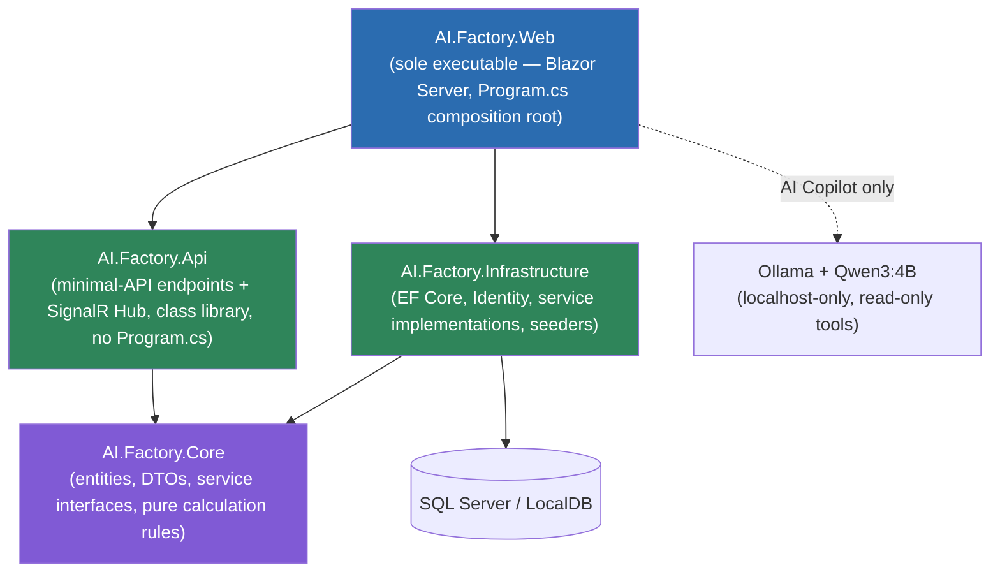

# AI Factory Command Center

A locked-scope portfolio build of a factory planning, procurement, and risk-monitoring system:
customer orders drive production plans, production plans drive material requirements, material
shortages drive purchase requests and incoming POs, and a Dashboard/AI Copilot/Machine
Monitoring layer surfaces risk in real time. Built across 14 locked days per
[`docs/00_Master_Scope.md`](docs/00_Master_Scope.md); day-by-day acceptance evidence lives in
[`docs/00_Project_Status.md`](docs/00_Project_Status.md).

All 11 locked modules/screens, 4 roles, 3 machines, 4 read-only AI tools, and all 15 locked
Required Tests are complete and verified (Days 1-13). Day 14 is portfolio/deployment wrap-up.

## Architecture

Modular monolith, one host, one origin. Dependency direction is enforced by project references —
`AI.Factory.Api` and `AI.Factory.Infrastructure` both depend on `AI.Factory.Core` but never on
each other; only `AI.Factory.Web` references both.



- **`AI.Factory.Core`** — no dependencies. Entities, enums, DTOs, command records, service
  *interfaces*, and pure calculation rules (`ProductionPlanRules`, `OrderRiskCalculator`,
  `MachineRules`, `PurchaseRequestRules`).
- **`AI.Factory.Infrastructure`** — `AppDbContext`, EF migrations, ASP.NET Core Identity, every
  service implementation, the canonical seeders, DI registration.
- **`AI.Factory.Api`** — Api references **Core only**. Minimal-API endpoint mapping + the
  `MachineHub` SignalR hub + authorization policy registration.
- **`AI.Factory.Web`** — the only executable. Composes Api + Infrastructure in `Program.cs`.
  Blazor Web App, global Interactive Server render mode. No `.Client` project, no WebAssembly.

Every feature is one vertical slice: a Core contract + an Infrastructure service (shared
verbatim by both the Blazor UI and the JSON API) + an Api endpoint extension + a Razor page.

## Database

14 application tables (verified by an automated invariant test on every build) plus standard
ASP.NET Core Identity tables. EF Core migrations are the schema source of truth;
[`deploy/database.sql`](deploy/database.sql) is the regenerated idempotent SQL fallback.

```mermaid
erDiagram
    RawMaterials ||--o{ FormulationMaterials : "recipe uses"
    Formulations ||--o{ FormulationMaterials : "recipe defines"
    Formulations ||--o{ CustomerOrders : "ordered as"
    CustomerOrders |o--o| ProductionPlans : "planned by"
    Machines ||--o{ ProductionPlans : "assigned to"
    ProductionPlans ||--o{ MaterialRequirements : "requires"
    RawMaterials ||--o{ MaterialRequirements : "required as"
    ProductionPlans ||--o{ PurchaseRequests : "sources"
    PurchaseRequests ||--o{ PurchaseRequestItems : "requests"
    RawMaterials ||--o{ PurchaseRequestItems : "requested"
    PurchaseRequests |o--o| IncomingPurchaseOrders : "fulfilled by"
    IncomingPurchaseOrders ||--o{ IncomingPurchaseOrderItems : "receives"
    RawMaterials ||--o{ IncomingPurchaseOrderItems : "received as"

    RawMaterials {
        bigint Id PK
        nvarchar Code UK
        decimal CurrentStock
        decimal ReservedStock
        rowversion RowVersion
    }
    Formulations {
        bigint Id PK
        nvarchar Code UK
        decimal BatchSize
    }
    CustomerOrders {
        bigint Id PK
        nvarchar OrderNumber UK
        bigint FormulationId FK
        decimal Quantity
        nvarchar Status "Lifecycle"
        rowversion RowVersion
    }
    ProductionPlans {
        bigint Id PK
        nvarchar PlanNumber UK
        bigint CustomerOrderId FK "unique — one plan per order"
        bigint MachineId FK
        int RequiredBatch "server-computed"
        nvarchar Status "Lifecycle"
        rowversion RowVersion
    }
    Machines {
        bigint Id PK
        nvarchar MachineCode UK
        nvarchar RunningStatus
        decimal Temperature
        nvarchar AlertStatus "server-computed"
        rowversion RowVersion
    }
    MaterialRequirements {
        bigint Id PK
        bigint ProductionPlanId FK
        bigint RawMaterialId FK
        decimal RequiredQuantity "server-computed"
    }
    PurchaseRequests {
        bigint Id PK
        nvarchar RequestNumber UK
        bigint SourceProductionPlanId FK "non-unique index"
        nvarchar Status
        rowversion RowVersion
    }
    IncomingPurchaseOrders {
        bigint Id PK
        bigint PurchaseRequestId FK UK "at most one PO per PR"
        nvarchar Status
        rowversion RowVersion
    }
    Alerts {
        bigint Id PK
        nvarchar AlertType
        nvarchar EntityName
        bigint EntityId "loose ref, filtered unique index when active"
        bit IsActive
    }
    AuditLogs {
        bigint Id PK
        nvarchar Action
        nvarchar Username
        nvarchar Result "append-only — no Update/Delete API"
    }
    AiToolExecutionLogs {
        bigint Id PK
        nvarchar ToolName
        nvarchar Result
    }
```

`Alerts`, `AuditLogs`, and `AiToolExecutionLogs` reference other entities loosely by
`EntityName`/`EntityId` rather than a formal foreign key, since they log against any entity type.
Four read-only SQL views (`vw_ProductionRiskReport`, `vw_MaterialShortageReport`,
`vw_PurchaseOrderStatusReport`, `vw_AuditLogReport`) back CSV exports and never count toward the
14-table limit.

## Modules

| # | Module | Roles that can write |
|---|---|---|
| 1 | Authentication (login/logout, 4 roles, audit) | — |
| 2 | Master Data (Raw Materials, Formulations) | Admin, Planner |
| 3 | Customer Orders | Admin, Planner |
| 4 | Production Plans (computed batches, material requirements) | Admin, Planner |
| 5 | Material Requirements query (cumulative availability by date) | read-only, all roles |
| 6 | Material Shortage + Purchase Request creation | Admin, Manager, Planner |
| 7 | Procurement (PR Submit/Approve/Reject, Incoming PO, receipt) | Admin, Manager (submit: + Planner) |
| 8 | Dashboard + Reports (KPI, CSV export) | read-only, all roles |
| 9 | AI Factory Copilot (4 allow-listed read-only tools, Ollama-backed) | read-only, all roles |
| 10 | Machine Monitoring (SignalR live push, Simulate Update) | Admin (simulate only) |
| 11 | Audit Log + Demo User Management | Admin, Manager (view); Admin (manage users) |

## Getting started

**Primary path** (needs the .NET SDK):

```powershell
.\deploy\setup.ps1
dotnet run --project src/AI.Factory.Web
```

**Fallback path** (no SDK/EF tooling — needs `sqlcmd`) and full IIS/troubleshooting instructions:
see [`deploy/installation-guide.md`](deploy/installation-guide.md).

Demo users (password `Demo@12345` for all — demo-only, never reuse):

| Username | Role |
|---|---|
| `admin.demo` | Admin |
| `manager.demo` | Manager |
| `planner.demo` | Planner |
| `viewer.demo` | Viewer |

## Running the tests

```powershell
.\.dotnet\dotnet.exe test AI.Factory.CommandCenter.sln
```

198 automated tests (89 unit, 109 integration) covering all 15 locked Required Tests — see
[`docs/00_Project_Status.md`](docs/00_Project_Status.md)'s Day 12 acceptance evidence for the
full Test 1-15 traceability matrix. `AI.Factory.UnitTests` includes invariant guards
(`FoundationContractTests`) that fail the build if the table count or a locked constraint drifts.
`AI.Factory.IntegrationTests` boots the real host against an EF Core InMemory database with a
frozen `TimeProvider`.

```powershell
.\.dotnet\dotnet.exe format --verify-no-changes
```

## Technology

ASP.NET Core 10 (Blazor Server, global Interactive Server) · EF Core 10 / SQL Server ·
ASP.NET Core Identity · SignalR · Serilog · Ollama (Qwen3:4B, localhost-only, read-only) · xUnit

## Scope discipline

Locked to one business flow: 11 modules/screens, 4 roles, 3 machines, 4 read-only AI tools, 14
application tables, 15 required business tests. No Docker, cloud deployment, microservices,
WebAssembly, AI write-access, or additional scope — see
[`docs/00_Master_Scope.md`](docs/00_Master_Scope.md) for the complete locked boundary and
[`docs/00_Project_Status.md`](docs/00_Project_Status.md) for day-by-day proof every boundary held.
